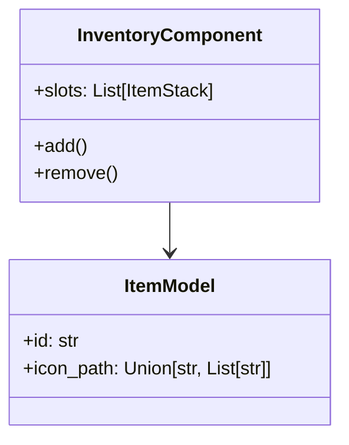
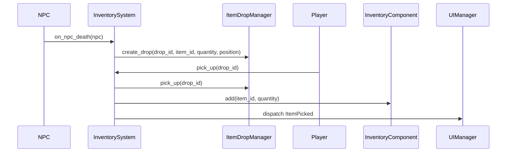

# Guía de desarrollo: Sistema de Inventario

## 1. Introducción
Este documento describe el diseño e implementación del sistema de inventario para jugadores y NPCs. Incluye:
- Definición de ítems (monedas, experiencia, madera).
- Plantillas de inventario para NPCs.
- Componente de inventario en jugadores y NPCs.
- Interfaz de usuario (UI) y manejo de entrada.

## Glosario de términos
- `template_id`: UUID de plantilla de NPC. Ejemplo: `"template_id": "b3f1e7c4-89ab-4d2c-9e1f-123456abcdef"`.
- `player_id`: UUID de jugador. Ejemplo: `"player_id": "d4c3b2a1-0987-6fed-cba5-abcdef123456"`.
- `stack_id`: UUID de pila en inventario. Ejemplo: `"stack_id": "f1e2d3c4-5678-9abc-def0-1234567890ab"`.
- `drop_id`: UUID de drop en el mapa. Ejemplo: `"drop_id": "a1b2c3d4-5678-9abc-def0-fedcba098765"`.
- `instance_id`: UUID de instancia de ítem en el juego. Ejemplo: `"instance_id": "0123abcd-4567-ef89-0123-456789abcdef"`.
- `schema_version`: Versión semántica del esquema JSON. Ejemplo: `"schema_version": "1.0.0"`.

## Getting Started
1. Instala dependencias: `pip install -r requirements.txt`
2. Valida esquemas: `check-jsonschema --schemafile schemas/ItemsSchema.json data/items.json`
3. Ejecuta tests: `pytest`

## Estructura de directorios
```
project_root/
  assets/
    items/
  data/
    items.json
    inventory_monsters.json
    inventory_player.json
    inventory_map.json
  schemas/
    ItemsSchema.json
    InventoryMonstersSchema.json
    InventoryPlayerSchema.json
    InventoryMapSchema.json
  src/
    roguelike_game/
      ecs/
        components/
          item_model.py
          inventory_component.py
          item_stack.py
        systems/
          inventory_system.py
        resources/
          map_manager.py
  docs/
    developer_guide/
      Inventario.md
      items.md
  tests/
    test_inventory.py
```

## Roadmap
- Crear y validar JSON Schemas
- Implementar modelos de datos y carga inicial
- Desarrollar componentes ECS de inventario
- Implementar UI básica y manejo de entrada
- Soporte de drops y pickups en el mapa

- Configurar tests y CI

## 2. Datos y formato JSON

### 2.1 Definición de Ítems
La definición y metadatos de los ítems se documenta en [`items.md`](items.md).


### 2.2 Plantillas de NPCs
Plantillas base en `data/defaults/inventory_monsters.json`. Archivo activo en `data/inventory_monsters.json`. Cada plantilla NPC incluye un campo `template_id` único (string):

> **template_id**: UUID que identifica la plantilla de inventario de un NPC, usado para vincular esta configuración JSON con la entidad NPC correspondiente en el juego.
```json
"barbol": {
  "template_id": "uuid-v4",
  ...,  
  "inventory": [
    { "item": "coins",      "min": 1,  "max": 5,  "chance": 0.8 },
    { "item": "experience", "min": 5,  "max": 15, "chance": 1.0 },
    { "item": "wood",       "min": 0,  "max": 3,  "chance": 0.5 }
  ]
}
```

### 2.3 Plantilla de Player
Plantilla base en `data/defaults/inventory_player.json`. Archivo activo en `data/inventory_player.json`. Incluye un campo `player_id` único (string):
```json
{
  "player_id": "uuid-v4",
  "capacity": 20,
  "slots": [
    { "item": "coins",      "quantity": 10 },
    null,
    { "item": "wood",       "quantity": 5 },
    ...
  ]
}
```
- `capacity`: número total de ranuras.
- `slots`: lista de ranuras (objeto o `null`).
- Cada ranura define `item` y `quantity`, y opcionalmente un `stack_id` (UUID) para identificar la pila.

**Instancias en el mapa:** Cuando un ítem/pila cae en el suelo, se registra con un `drop_id` (UUID) en `inventory_map.json` para referenciar su posición y estado.

## 3. Modelo de Ítems
Definir una clase base `Item` con atributos comunes. El parámetro `icon_path` puede ser una ruta (str) o una lista de rutas (List[str]) para soportar animaciones:
```python
from typing import Union, List

class Item:
    def __init__(self, id: str, icon_path: Union[str, List[str]], stackable: bool = True):
        self.id = id
        self.icon_path = icon_path
        self.stackable = stackable
```
> **Propiedades de visualización de Ítems**: cada Item incluye propiedades `scale_editor`, `scale_map`, `scale_inventory` (floats) y `z_layer` (int) para ajustar su tamaño y su capa de renderizado en diferentes contextos.
>
> **Renderizado en el mapa**: El sistema `MapLoadDropsSystem` añade a cada entidad de drop los componentes `Sprite`, `Scale` y `ZLayer`. El sistema de renderizado principal (`RendererManager`) agrupa todas las entidades con `Sprite` y `ZLayer` y las dibuja ordenadas por `layer` y posición Y. El antiguo `DropRenderSystem` se ha eliminado.
```
Subclases o componentes ECS:
- `CoinItem`, `ExperienceItem`, `WoodItem`.

## 4. Integración de NPCs y Player

Este apartado describe la integración de plantillas de inventario y gestión unificada para NPCs y Player:

1. **Plantillas base y activas**:
    - Base NPCs: `data/defaults/inventory_monsters.json`; activo: `data/inventory_monsters.json`.
    - Base Player: `data/defaults/inventory_player.json`; activo: `data/inventory_player.json`.

2. **Inicialización de inventarios**:
    - `InventoryInitSystem` carga la plantilla base desde `data/defaults/...`.
    - Crea entidades con `InventoryComponent` y `PlayerTag` o `NPCTag`.
    - Puebla el componente con `add(item_id, qty)`.
    - Persiste el inventario inicial en los archivos activos (`data/inventory_monsters.json` o `data/inventory_player.json`).

3. **DeathDropSystem (NPC y Player)**:
    - Implementar `DeathDropSystem` en `src/roguelike_game/ecs/systems/inventory/death_drop_system.py` que suscriba al evento de muerte para entidades con `PlayerTag` y `NPCTag`.
    - Al morir, itera por cada `ItemStack` en `InventoryComponent.slots`:
        - Llama a `ItemDropManager.create_drop(drop_id, item_id, quantity, zone_id, position=death_position)`.
    - Vacía `InventoryComponent.slots`.
    - Actualiza los archivos activos (`data/inventory_monsters.json` o `data/inventory_player.json`) para la persistencia.

4. **Transferencia de ítems**:
    - Crear `InventoryTransferSystem` en `src/roguelike_game/ecs/systems/inventory/inventory_transfer_system.py` con:
        - Método `transfer(item_id, qty, source_entity, target_entity)` garantizando transacciones atómicas y rollback.
        - Despacho de eventos `TransferEvent` para UI y logs.

5. **Editor de inventarios (F6)**:
    - Capturar tecla F6 en `InventoryInputSystem` para activar modo editor.
    - Implementar `InventoryEditorSystem` (fase *update*/*render*) con UI overlay:
        - Selector de entidad (Player, NPCs).
        - Grids de slots de plantilla y estado actual.
        - Drag & drop entre slots.
        - Botones “Guardar plantilla” y “Aplicar cambios”.

6. **Persistencia y eventos**:
    - Guardar plantillas modificadas en `data/inventory_monsters.json` e `inventory_player.json`.
    - Aplicar cambios runtime en `InventoryComponent`.
    - Despacho de eventos ECS: `InventoryEditorOpened`, `InventoryChanged`, `InventoryEditorClosed`.

7. **Pruebas y CI**:
    - Unit tests para `InventoryInitSystem`, `NPCDeathSystem`, `InventoryTransferSystem`.
    - E2E tests de flujo de integración y editor.
    - CI: Validar JSON y ejecutar pytest.

## 5. Componente de inventario en entidades (jugadores y NPCs)

## 5. Componente de inventario en entidades (jugadores y NPCs)
```python
from typing import List, Optional

class ItemStack:
    def __init__(self, item_id: str, quantity: int):
        self.item_id = item_id
        self.quantity = quantity

class InventoryComponent:
    def __init__(self, capacity: int = 20):
        # Lista de ItemStack o None para ranuras vacías
        self.slots: List[Optional[ItemStack]] = [None] * capacity

    def add(self, item_id: str, qty: int) -> bool:
        # Lógica para apilar o usar ranura vacía
        ...

    def remove(self, item_id: str, qty: int) -> bool:
        ...

    def has(self, item_id: str, qty: int) -> bool:
        ...
```

## API Reference

### InventoryComponent
```python
from typing import List, Optional

class InventoryComponent:
    def __init__(self, capacity: int, player_id: str):
        """Inicializa capacidad y player_id"""
        self.player_id = player_id
        self.slots: List[Optional[ItemStack]] = [None] * capacity

    def add(self, item_id: str, qty: int) -> bool:
        """Añade cantidad a la pila existente o ranura vacía"""
        ...

    def remove(self, item_id: str, qty: int) -> bool:
        """Elimina cantidad de la pila o devuelve False si insuficiente"""
        ...

    def has(self, item_id: str, qty: int) -> bool:
        """Verifica si existe al menos qty del ítem"""
        ...

    def serialize(self) -> dict:
        """Serializa inventario a dict para guardado"""
        ...
```

### ItemModel
```python
from typing import Union, List, Optional

class ItemModel:
    """Modelo de datos para ítems cargados de JSON"""
    def __init__(
        self, id: str, name: str, description: str,
        icon_path: Union[str, List[str]], stackable: bool,
        max_stack: Optional[int] = None, experience: Optional[int] = None,
        effect: Optional[str] = None, equip_slot: Optional[str] = None,
        durability: Optional[int] = None, quest_id: Optional[str] = None
    ):
        ...
```

Este gestor persiste los “drops” en el suelo usando JSON con campos:
- `item_id`: Identificador de ítem
- `quantity`: Cantidad en el montón
- `zone_id`: Zona del mapa donde se ubica
- `tile`: Coordenadas de celda (enteras) *o* `position`: Coordenadas en píxeles (flotantes)
- `schema_version`: Versión del esquema JSON

### ItemDropManager
```python
from typing import List, Dict, Union

class ItemDropManager:
    def __init__(self, path: str):
        """Inicializa gestor de drops con ruta a inventory_map.json"""
        self.path = path
        ...

    def create_drop(self, drop_id: str, item_id: str, quantity: int, zone_id: str, tile: Dict[str, int] = None, position: Dict[str, float] = None):
        """Registra un drop en el mapa con su drop_id, zona y coordenadas de tile o posición relativa"""
        ...

    def pick_up(self, drop_id: str) -> bool:
        """Elimina el drop del mapa y devuelve True si recogido"""
        ...

    def load_all(self) -> List[Dict]:
        """Carga todos los drops persistidos desde inventory_map.json"""
        ...
```

## 6. Diseño de la UI
- **Ventana modal** sobre el juego.
- **Grid de ranuras** (por ejemplo, 5×4).
- Cada ranura muestra icono y cantidad.
- **Drag & Drop** entre ranuras y al suelo.
- **Tooltip** con nombre y descripción al pasar el ratón.

## 7. Manejo de entrada
- Mapear tecla `I` para alternar la ventana de inventario:
```python
if input.is_key_pressed("I"):
    inventory_window.toggle()
```
- Pausar la lógica de movimiento y combate mientras la UI esté abierta.

## 8. Ejemplos de archivo JSON y código
Ver secciones anteriores para fragmentos completos y adaptarlos al proyecto.

## 9. Extensiones futuras
- **Loot Tables y Drop Tables configurables**: Definir probabilidades ponderadas y reglas de rareza.
- **Sistemas de Efectos y Estados**: Asociar buffs, debuffs, animaciones y condiciones de uso a los ítems.
- **Expiración de Drops**: Auto-eliminación de montones tras un tiempo configurable.
- **Modding y Scripting**: Permitir la carga dinámica de definiciones de ítems, drops y comportamientos.
- **Localización e i18n**: Soporte multilenguaje para nombres, descripciones y tooltips.
- **Validación de Assets en Build Pipeline**: Verificar integridad de iconos, sonidos y datos antes de compilación.
- **Telemetría y Analytics**: Exportar eventos de inventario para análisis de jugabilidad y balance.
- **Registro y Factory de Ítems**: Centralizar la creación y configuración de instancias de ítems.
- **Cache y Particionamiento Espacial**: Optimizar búsqueda y spawn de drops por zona/chunks.
- **Rendimiento y Escalabilidad**: Pools de objetos, profiling y optimizaciones de memoria.
- **Interfaz Avanzada**: Split stacks, multi-select, contexto, shortcuts (shift-click, hotkeys).
- **Seguridad y Anti-Cheat**: Validación de transferencias y estados en multiplayer.
- **Documentación y Schema-Driven Development**: Generación automática de docs desde JSON Schema.

---

## 10. Validación con JSON Schema
Los JSON Schema son definiciones formales que especifican la estructura, tipos de datos y reglas de validación de los archivos JSON del proyecto. Permiten:
- Asegurar que los datos cumplan el formato esperado.
- Detectar errores de forma temprana antes de la ejecución.
- Documentar explícitamente campos obligatorios y rangos.

Se proveen esquemas en `schemas/`:
- `ItemsSchema.json`
- `InventoryMonstersSchema.json`
- `InventoryPlayerSchema.json`
- `InventoryMapSchema.json`

Estos definen tipos, campos obligatorios y valores por rango.

## 11. Flujos de Uso
**Carga de datos**:
```python
# Leer JSON y validar
from jsonschema import validate, ValidationError
import json

with open('schemas/ItemsSchema.json') as f:
    schema = json.load(f)
items = json.load(open('data/items.json'))
validate(instance=items, schema=schema)
# Mapear a objetos de juego
from models import ItemModel
item_objs = [ItemModel(**v) for v in items.values()]
```
**Operaciones**:
- `add(item_id, qty)`, `remove(item_id, qty)`, `has(item_id, qty)`.
- División de pilas: crear nuevo `stack_id`.
- Drop de NPC: generar `drop_id`, persistir en mapa.

## 12. Tipos de Ítem y Extensiones
- **Consumibles**: campo `effect`, `cooldown`.
- **Equipables**: `equip_slot`, `durability`, `modifiers`.
- **Quest-Items**: `quest_id`, `collectible`, `value`.
- **Valores adicionales**: `rarity`, `market_value`.

## 13. Diseño de UI/UX
- Mock-ups usando herramientas gráficas (ej. Figma).
- Estados de ranura: vacío, seleccionado, sobrecarga.
- Controles: arrastrar/soltar, atajos de teclado.
- Feedback visual: resaltado, tooltips.

## 14. Multiplayer y Sincronización
- Uso de `drop_id` y `stack_id` para referenciar instancias.
- Transmitir solo operaciones (diffs) en vez de estado completo.
- Resolución de conflictos: locks optimistas o prioridades de servidor.

## 15. Persistencia y Versionado
- Guardado en caliente vs checkpoints.
- Incluir campo `schema_version` en cada JSON.
- Migraciones: scripts para actualizar formatos.

## 16. Hooks y Eventos
- Eventos: `ItemAdded`, `ItemRemoved`, `InventoryFull`, `ItemDropped`, `ItemPicked`.
- Sistema de suscripción: callbacks en UI, logs, IA.

## 17. Ejemplos de Código
Ver sección de JSON Schema y pydantic. Añadir tests unitarios en `tests/test_inventory.py`:
```python
import pytest
from components.inventory import InventoryComponent

def test_add_remove():
    inv = InventoryComponent(capacity=2)
    assert inv.add('gold', 5)
    assert inv.has('gold', 5)
    assert inv.remove('gold', 3)
    assert inv.has('gold', 2)
```

## Testing & CI
- Ubicación de tests: `tests/`
- Ejecutar con: `pytest`
- Validación de JSON y tests integrados en CI (GitHub Actions):
```yaml
name: CI
on: [push, pull_request]
jobs:
  test:
    runs-on: ubuntu-latest
    steps:
      - uses: actions/checkout@v2
      - name: Setup Python
        uses: actions/setup-python@v2
        with:
          python-version: '3.x'
      - name: Install dependencies
        run: pip install -r requirements.txt
      - name: Validate Schemas
        run: |
          check-jsonschema --schemafile schemas/ItemsSchema.json data/items.json
          check-jsonschema --schemafile schemas/InventoryMonstersSchema.json data/inventory_monsters.json
      - name: Run tests
        run: pytest
```


## 18. Diagramas UML y de Secuencia




## 19. Convenciones y Estilo
- UUIDv4 para IDs.
- JSON con indentación de 2 espacios.
- Rutas relativas desde raíz (`assets/…`, `data/…`).
- Campos ordenados alfabéticamente.

---

**Fin de la guía de Inventario**
