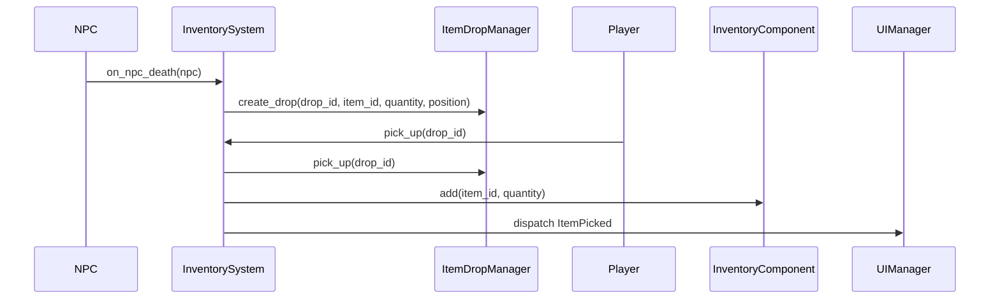

# Plan de implementación: Sistema de Inventario

Este documento describe el roadmap de alto nivel para llevar a producción la guía de inventario (`Inventario.md`). Tras cada sección, el proyecto deberá compilarse y funcionar correctamente.

## Requisitos previos
- Dependencias:
  - jsonschema
  - pydantic
  - pytest
  - mermaid-cli (opcional para diagramas)
- Asegurarse de que el juego arranca sin errores actuales.

## 1. JSON Schemas y datos de ejemplo
1. Crear o comprobar o actualizar esquemas JSON en `schemas/` para:
   - `ItemsSchema.json`
   - `InventoryMonstersSchema.json`
   - `InventoryPlayerSchema.json`
   - `InventoryMapSchema.json`
2. Definir ejemplos mínimos en `data/` que cumplan cada esquema.
3. Validar con `check-jsonschema --schemafile schemas/ItemsSchema.json data/items.json`.

> Estado tras paso 1: Validación JSON completada sin errores.

## 2. Modelos de datos
1. Implementar o comprobar o actualizar `ItemModel` (pydantic) y `ItemStack` en `src/roguelike_game/ecs/components/item_models.py`.
2. Escribir tests para carga de `items.json` y validación de atributos.

> Estado tras paso 2: Tests de modelos pasan.

## 3. Componente de Inventario
1. Desarrollar `InventoryComponent` en `src/roguelike_game/ecs/components/inventory_component.py` con métodos:
   - `add(item_id, qty)`
   - `remove(item_id, qty)`
   - `has(item_id, qty)`
   - `serialize()`
2. Añadir tests unitarios en `tests/test_inventory.py`.

> Estado tras paso 3: Inventario base funciona y tests pasan.

## 4. Mapa de drops

> Nota: Al crear drops, se puede usar `tile` (enteros) o `position` (píxeles). Ambos formatos son válidos y se eligen según la necesidad de precisión.
1. Crear `ItemDropManager` en `src/roguelike_game/managers/map/item_drop_manager.py` con:
   - `create_drop(drop_id, item_id, quantity, zone_id, tile=None, position=None)`
   - `pick_up(drop_id)`
   - `load_all()`
2. Definir `inventory_map.json` y tests de flujo drop→pickup.
3. Spawnear y visualizar drops en el mapa: implementar `MapLoadDropsSystem` que use `ItemDropManager.load_all()` para crear entidades con `PhysicalItemComponent`, `Position` y `CollectibleComponent`. Añadir tests de integración que verifiquen la correcta aparición de los ítems en la escena.
4. Asignar componentes `ZLayer`, `Sprite` y `Scale` en `MapLoadDropsSystem`:
    - Leer el campo `z_layer` de `ItemModel` (o usar un valor por defecto, p.ej. `DEFAULT_Z`).
    - Establecer `ZLayer`: `world.components['ZLayer'][eid] = ZLayer(layer)`.
    - Añadir `Sprite` (ruta de ícono) y `Scale` (factor `scale_map`) a la entidad.
    Estos componentes permiten que el sistema de renderizado principal (`RendererManager`) dibuje los drops junto con otras entidades, ordenándolos por `ZLayer` y posición Y. El antiguo `DropRenderSystem` ha sido eliminado.
5. Implementar `DropHoverRenderSystem` para hover sobre drops en el mapa:
    - Registrar `DropHoverRenderSystem` en `system_registry.get_render_system_classes()`.
    - Detectar hover del cursor sobre entidades de drop (colisión con `Sprite` y `ZLayer`), priorizando la capa más alta.
    - Resaltar el drop hovered con un borde amarillo.
    - Mostrar un cuadro de información semitransparente (tooltip) con el nombre y descripción del ítem cerca del cursor.

> Estado tras paso 4: Drops en mapa funcionan y no rompen inventario.

## 5. Integración de NPCs y Player

1. Plantillas base y archivos activos (runtime):
    - Base NPCs: `data/defaults/inventory_monsters.json` (plantillas por `template_id`).
    - Activo NPCs: `data/inventory_monsters.json` (mapea `entity_id` → instancia de inventario).
    - Base Player: `data/defaults/inventory_player.json` (plantilla por `player_id`).
    - Activo Player: `data/inventory_player.json` (mapea `entity_id` → instancia de inventario).

2. Implementar `InventoryInitSystem` en `src/roguelike_game/ecs/systems/inventory/inventory_init_system.py` con:
    - Detectar entidades con `PlayerTag` y `NPCTag`.
    - Cargar plantilla base desde `data/defaults/inventory_*.json` y poblar `InventoryComponent` con `add(item_id, qty)`.
    - Registrar el inventario inicial en `data/inventory_monsters.json` o `data/inventory_player.json` usando `entity_id` como clave. El registro incluye:
        - `template_id` o `player_id`.
        - `slots`: serialización de `InventoryComponent.serialize()`.
        - `schema_version`. 

3. Implementar `DeathDropSystem` en `src/roguelike_game/ecs/systems/inventory/death_drop_system.py` con:
    - Escuchar evento de muerte de entidades con `PlayerTag` y `NPCTag`.
    - Iterar `InventoryComponent.slots` y usar `ItemDropManager.create_drop(drop_id, item_id, quantity, zone_id, position=death_position)` para cada `ItemStack`.
    - Vaciar `InventoryComponent.slots` y persistir en `data/inventory_monsters.json` o `data/inventory_player.json`.

4. Crear `InventoryTransferSystem` en `src/roguelike_game/ecs/systems/inventory/inventory_transfer_system.py` con:
    - Método `transfer(item_id, qty, source_entity, target_entity)` que asegura transacciones atómicas y rollback en fallo.
    - Despacho de `TransferEvent` para UI y logs.

5. Implementar `InventoryDropSystem` en `src/roguelike_game/ecs/systems/inventory/inventory_drop_system.py` con:
    - Capturar acción de dropeo (p.ej. tecla D o botón UI) en `InventoryInputSystem`.
    - Llamar a `ItemDropManager.create_drop(drop_id, item_id, quantity, zone_id, position)` para cada ítem seleccionado.
    - Remover el ítem del `InventoryComponent` con `remove(item_id, quantity)`.
    - Persistir en `data/inventory_monsters.json` o `data/inventory_player.json` mapeando `entity_id`.

6. Implementar `InventoryPickupSystem` en `src/roguelike_game/ecs/systems/inventory/inventory_pickup_system.py` con:
    - Detectar colisión/interacción con drops (`CollectibleComponent`).
    - Llamar a `InventoryComponent.add(item_id, quantity)`.
    - Usar `ItemDropManager.pick_up(drop_id)` y remover la entidad de drop.
    - Persistir inventario actualizado en el JSON activo.

7. Editor de inventarios (F6):
    - Capturar tecla F6 en `InventoryInputSystem` para activar modo editor.
    - Implementar `InventoryEditorSystem` (fase update/render) con UI overlay:
        - Selector de entidad (Player, NPCs).
        - Grids de slots: plantilla y estado actual.
        - Drag & drop entre slots.
        - Botones “Guardar plantilla” y “Aplicar cambios”.

8. Persistencia y eventos:
    - Al guardar cambios de inventario (editor o runtime), actualizar los archivos activos (`data/inventory_monsters.json` / `data/inventory_player.json`) mapeando `entity_id` → datos serializados de `InventoryComponent`.
    - Aplicar cambios runtime en `InventoryComponent`.
    - Despachar eventos ECS: `InventoryEditorOpened`, `InventoryChanged`, `InventoryEditorClosed`.

9. Pruebas y CI:
    - Pruebas unitarias para `InventoryInitSystem`, `DeathDropSystem`, `InventoryDropSystem`, `InventoryPickupSystem` y `InventoryTransferSystem`.
    - Tests E2E para flujo completo: init → drop al morir → drop manual → pickup → transferencia → editor (F6).
    - CI (GitHub Actions): validar JSON con jsonschema y ejecutar pytest.

10. Sistemas futuros:
    - `NPCTradeSystem`: implementar UI de comercio, eventos `TradeRequest`, `TradeExecute` y rollback en fallo.
    - `ContainerComponent`/`ContainerSystem`: soportar contenedores (cofres, baúles) con inventarios propios y transferencia genérica.

> Estado tras paso 9: Flujo de inventario completo (init, drop al morir, drop manual, pickup, transferencia, editor).

## 6. UI e interacción
1. Implementar ventana de inventario y grid de slots.
2. Conectar eventos de teclado (`I`) y drag & drop.
3. Validar tooltips e indicadores de estado.
4. Extraer componentes de UI reutilizables (tooltip, highlight) al módulo `roguelike_ui.ui_helpers`.

> Estado tras paso 6: UI de inventario operativa sin errores.

## 7. Persistencia y versionado
1. Serializar/deserializar inventario de jugador en `data/`.
2. Incluir `schema_version` en JSON y crear script de migración simple.

> Estado tras paso 7: Guardado/carga de partidas estable.

## 8. Documentación y CI
1. Confirmar que `docs/developer_guide` está alineado con código.
2. Configurar GitHub Actions para:
   - Validar JSON con `jsonschema`.
   - Ejecutar tests con `pytest`.

> Estado tras paso 9: Pipeline verde y documentación confiable.

### Requisitos avanzados para un sistema de inventario robusto
- **EventBus / MessageBroker**: Canal central para eventos (`SpawnDropEvent`, `PickupEvent`, `TransferEvent`).
- **Integridad transaccional**: Operaciones de transferencia atómicas (commit/rollback) para evitar estados inconsistentes.
- **Control de concurrencia**: Locks o semáforos al leer/escribir persistencia para evitar race conditions.
- **Sincronización en red (multijugador)**: Propagar cambios de inventario a clientes y servidor.
- **Logging y telemetría**: Registrar eventos de drops y pickups para auditoría y debugging.
- **Pruebas E2E y mocks**: Mocks de `ItemDropManager` e `InventoryComponent`, tests integrales de flujo inventario.
- **UI Data Binding**: Enlazar estados ECS con la interfaz para feedback y refresco automático.
- **Inyección de dependencias / Singleton**: Registrar `DropService` e `InventoryService` para facilitar testing y mantenimiento.
- **Loot Tables / Drop Tables configurables**: Definir tablas de probabilidad ponderadas para drops dinámicos.
- **Sistema de Efectos y States**: Vincular ítems a efectos (buffs/debuffs), animaciones y condiciones de uso.
- **Políticas de expiración de drops**: Auto-limpieza de montones tras tiempo configurable.
- **Soporte de mods y scripting**: Cargar definiciones de ítems y drops desde plugins o scripts externos.
- **Item Registry / Factory**: Centralizar la definición y construcción de instancias de ítems.

## 9. Sistemas ECS y eventos

**Componentes necesarios:**
- `InventoryComponent`: Gestor de ranuras (slots) para jugador y NPC.
- `PhysicalItemComponent`: Representa montones en el suelo con `drop_id`, `item_id`, `quantity`.
- `CollectibleComponent`: Etiqueta para entidades recogibles.
- `Position`: Coordenadas (tile o píxeles).
- `PlayerTag` / `NPCTag`: Etiquetas para filtrar entidades.

**Sistemas necesarios:**
- `MapLoadDropsSystem`: Carga y spawnea drops del JSON en el mundo.
- `NPCInventorySystem`: Inicializa el `InventoryComponent` en NPCs desde plantilla.
- `NPCDeathSystem`: Convierte inventario de NPC en drops al morir.
- `PickupSystem`: Gestiona la recogida de drops y actualiza inventarios.
- `InventoryTransferSystem`: Transfiere ítems entre inventarios (suelo, jugador, NPC).
- `MapPersistDropsSystem` (opcional): Persiste cambios en `inventory_map.json`.
- `InventoryUISystem` & `InventoryInputSystem`: Dibuja y maneja la UI de inventario.

## 9. Sistemas ECS y eventos
1. Crear `src/roguelike_game/ecs/systems/inventory_system.py` con métodos:
   - `on_npc_death(npc: NPC)` que dispare evento `SpawnDrop(item_id, quantity, position)`.
   - `on_pick_up(player_id: str, drop_id: str) -> bool` que invoque `PickupEvent(drop_id)` y `InventoryComponent.add(item_id, quantity)`.
   - Disparar eventos `ItemDropped` y `ItemPicked` para UI y logs.
2. Añadir tests unitarios en `tests/test_inventory_system.py` para validar la lógica de drops y pickups.

> Estado tras paso 10: InventorySystem gestiona drops y pickups.

## 10. Pruebas End-to-End
1. Crear tests en `tests/e2e/test_inventory_flow.py` con escenarios:
   - NPC muere → aparece drop en mapa → jugador recoge drop → inventario actualizado.
2. Validar estado de `inventory_map.json` y `inventory_player.json` tras cada operación.

> Estado tras paso 12: Flujo completo probado sin errores.

## 11. Diagramas de Secuencia
Actualizar diagramas en `docs/developer_guide/Inventario.md` con flujo detallado:

> Estado tras paso 13: Documentación visual completa.

---

**Fin del plan de implementación**
