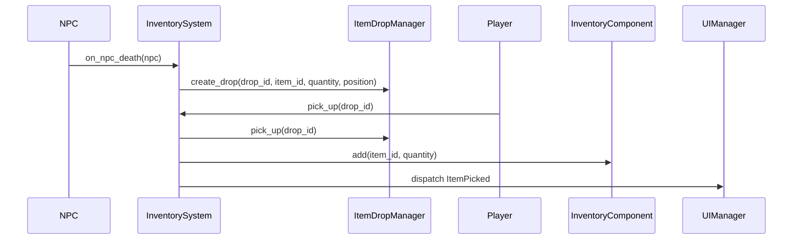

# Plan de implementación: Sistema de Inventario

Este documento describe el roadmap de alto nivel para llevar a producción la guía de inventario (`Inventario.md`). Tras cada sección, el proyecto deberá compilarse y funcionar correctamente.

## Requisitos previos
- Dependencias:
  - jsonschema
  - pydantic
  - pytest
  - mermaid-cli (opcional para diagramas)
- Asegurarse de que el juego arranca sin errores actuales.

## 1. JSON Schemas y datos de ejemplo
1. Crear o comprobar o actualizar esquemas JSON en `schemas/` para:
   - `ItemsSchema.json`
   - `InventoryMonstersSchema.json`
   - `InventoryPlayerSchema.json`
   - `InventoryMapSchema.json`
2. Definir ejemplos mínimos en `data/` que cumplan cada esquema.
3. Validar con `check-jsonschema --schemafile schemas/ItemsSchema.json data/items.json`.

> Estado tras paso 1: Validación JSON completada sin errores.

## 2. Modelos de datos
1. Implementar o comprobar o actualizar `ItemModel` (pydantic) y `ItemStack` en `src/roguelike_game/ecs/components/item_models.py`.
2. Escribir tests para carga de `items.json` y validación de atributos.

> Estado tras paso 2: Tests de modelos pasan.

## 3. Componente de Inventario
1. Desarrollar `InventoryComponent` en `src/roguelike_game/ecs/components/inventory_component.py` con métodos:
   - `add(item_id, qty)`
   - `remove(item_id, qty)`
   - `has(item_id, qty)`
   - `serialize()`
2. Añadir tests unitarios en `tests/test_inventory.py`.

> Estado tras paso 3: Inventario base funciona y tests pasan.

## 4. Mapa de drops
1. Crear `ItemDropManager` en `src/roguelike_game/managers/map/item_drop_manager.py` con:
   - `create_drop(drop_id, item_id, quantity, zone_id, tile=None, position=None)`
   - `pick_up(drop_id)`
   - `load_all()`
2. Definir `inventory_map.json` y tests de flujo drop→pickup.

> Estado tras paso 4: Drops en mapa funcionan y no rompen inventario.

## 5. Integración de NPCs
1. Actualizar función `on_npc_death` para usar `inventory_monsters.json`.
2. Probar dropeo de NPCs en entorno de juego.

> Estado tras paso 5: NPCs dropean items según plantilla.

## 6. UI e interacción
1. Implementar ventana de inventario y grid de slots.
2. Conectar eventos de teclado (`I`) y drag & drop.
3. Validar tooltips e indicadores de estado.

> Estado tras paso 6: UI de inventario operativa sin errores.

## 7. Persistencia y versionado
1. Serializar/deserializar inventario de jugador en `data/`.
2. Incluir `schema_version` en JSON y crear script de migración simple.

> Estado tras paso 7: Guardado/carga de partidas estable.

## 8. Documentación y CI
1. Confirmar que `docs/developer_guide` está alineado con código.
2. Configurar GitHub Actions para:
   - Validar JSON con `jsonschema`.
   - Ejecutar tests con `pytest`.

> Estado tras paso 9: Pipeline verde y documentación confiable.

## 9. Sistemas ECS y eventos
1. Crear `src/roguelike_game/ecs/systems/inventory_system.py` con métodos:
   - `on_npc_death(npc: NPC)` que dispare evento `SpawnDrop(item_id, quantity, position)`.
   - `on_pick_up(player_id: str, drop_id: str) -> bool` que invoque `PickupEvent(drop_id)` y `InventoryComponent.add(item_id, quantity)`.
   - Disparar eventos `ItemDropped` y `ItemPicked` para UI y logs.
2. Añadir tests unitarios en `tests/test_inventory_system.py` para validar la lógica de drops y pickups.

> Estado tras paso 10: InventorySystem gestiona drops y pickups.

## 10. Pruebas End-to-End
1. Crear tests en `tests/e2e/test_inventory_flow.py` con escenarios:
   - NPC muere → aparece drop en mapa → jugador recoge drop → inventario actualizado.
2. Validar estado de `inventory_map.json` y `inventory_player.json` tras cada operación.

> Estado tras paso 12: Flujo completo probado sin errores.

## 11. Diagramas de Secuencia
Actualizar diagramas en `docs/developer_guide/Inventario.md` con flujo detallado:

> Estado tras paso 13: Documentación visual completa.

---

**Fin del plan de implementación**
