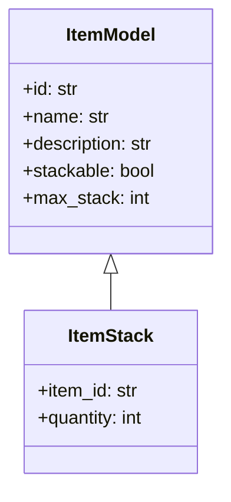

# Guía de desarrollo: Especificación de Ítems
> **Nota:** ItemModel incluye nuevas propiedades `scale_editor`, `scale_map` y `scale_inventory` para controlar el tamaño de visualización en distintos contextos.

Este documento detalla los metadatos y atributos de cada ítem disponible en el juego.

## Getting Started
1. Instala dependencias: `pip install -r requirements.txt`
2. Valida JSON Schema con: `check-jsonschema --schemafile schemas/ItemSchema.json data/items.json`
3. Ejecuta tests: `pytest`

## Estructura de directorios
```
project_root/
  data/
    items.json
  schemas/
    ItemSchema.json
  docs/
    developer_guide/
      items.md
  src/
    roguelike_game/
      ecs/
        components/
          item_models.py
        systems/
        resources/
    roguelike_editors/
      items/
        __init__.py
        model/
        view/
        controller/
  tests/
    test_items.py
```


## 1. Glosario de términos
- `id`: Identificador único del tipo de ítem.
- `instance_id`: Identificador único de la instancia de un ítem en el mundo o en un inventario.
- `stack_id`: Identificador UUID para pilas en el inventario.
- `drop_id`: Identificador UUID para ítems/pilas en el mapa.
- `template_id`: Identificador UUID para plantillas de NPC.
- `player_id`: Identificador UUID para plantillas de jugador.
- `schema_version`: Versión semántica del esquema JSON.

**Nota:** Cada ítem posee un campo `id` único (string) que se utiliza para referenciarlo en archivos de inventario y mapas.

**Instancias de ítems:** Cada vez que un ítem aparece en el mundo o en un inventario, se genera una instancia que puede llevar un `instance_id` (UUID). Por convención:
- `stack_id`: UUID que identifica una pila de ítems en un inventario.
- `drop_id`: UUID que identifica un ítem o pila en el mapa.


## 2. Ítems iniciales

1. **Orbe de Experiencia**
   ```json
   {
     "id": "experience_orb",
     "name": "Orbe de Experiencia",
      "experience": 10,
     "icon": [
       "assets/items/exp_orb_1.png",
       "assets/items/exp_orb_2.png",
       "assets/items/exp_orb_3.png",
       "assets/items/exp_orb_4.png"
     ],
     "description": "Objeto que otorga puntos de experiencia al recogerse.",
     "stackable": false
   }
   ```

2. **Oro (Gold)**
   ```json
   {
     "id": "gold",
     "name": "Oro",
     "icon_small": "assets/items/gold_coin_stack_1.png",
     "icon_large": "assets/items/gold_coin_stack_2.png",
     "description": "Monedas de oro para comprar y comerciar.",
     "stackable": true,
     "max_stack": 999,
     "threshold": 10
   }
   ```

3. **Madera (Wood)**
   ```json
   {
     "id": "wood",
     "name": "Madera",
     "icon": "assets/items/wood_log_bundle.png",
     "description": "Recurso básico de madera.",
     "stackable": true,
     "max_stack": 99
   }
   ```

---

> Para más ítems, editar `data/items.json` y actualizar esta guía en consecuencia.

## 3. JSON Schema para Ítems

Se incluye `ItemSchema.json` en `schemas/` con la definición formal de campos, tipos y validaciones.

## 4. Tipos de Ítem y Extensiones

- Consumibles: incluyen campo `effect` (string) para definir la acción al usar.
- Equipables: campos `equip_slot` (p.ej. "head","body","weapon") y `durability` (int).
- Quest-Items: incluyen `quest_id` (UUID) y flag `collectible`.

## 5. Carga y Validación de JSON

Ejemplo con `pydantic`:
```python
from pydantic import BaseModel
from typing import Optional, List, Union

class ItemModel(BaseModel):
    id: str
    name: str
    description: str
    stackable: bool
    max_stack: Optional[int] = None
    icon: Union[str, List[str]]
    icon_small: Optional[str] = None
    icon_large: Optional[str] = None
    threshold: Optional[int] = None
    experience: Optional[int] = None
    effect: Optional[str] = None
    equip_slot: Optional[str] = None
    durability: Optional[int] = None
    quest_id: Optional[str] = None
```

## 6. Ejemplos de Uso
Lee y accede a ítems desde JSON:
```python
from roguelike_game.ecs.components.item_models import load_items

items = load_items('data/items.json')
item = items['gold']
print(item.name, item.max_stack)
```

## Editor de Ítems (UI)
Paquete: `src/roguelike_editors/items`

Estructura MVC:
```
src/roguelike_editors/items/
  __init__.py       # expone ItemEditor
  model/
    editor_model.py             # define ItemEditorModel
  view/
    editor_view.py              # define ItemEditorView (renderiza panel e ítems)
  controller/
    editor_controller.py        # define ItemEditorController (maneja eventos: F7, navegación)
```

Uso:
```python
from roguelike_editors.items import ItemEditor

editor = ItemEditor(game.items, game.item_assets)
for event in pygame.event.get():
    editor.handle_event(event)
# En la fase de render:
editor.draw(screen)
```

## 7. API Reference
```python
from pydantic import BaseModel
from typing import Optional, List, Union

class ItemModel(BaseModel):
    """Modelo de datos para ítems cargados del JSON"""
    id: str
    name: str
    description: str
    stackable: bool
    max_stack: Optional[int] = None
    icon: Union[str, List[str]]
    icon_small: Optional[str] = None
    icon_large: Optional[str] = None
    threshold: Optional[int] = None
    experience: Optional[int] = None
    effect: Optional[str] = None
    equip_slot: Optional[str] = None
    durability: Optional[int] = None
    quest_id: Optional[str] = None

class ItemStack:
    """Representa una pila de ítems en inventario"""
    def __init__(self, item_id: str, quantity: int):
        self.item_id = item_id
        self.quantity = quantity
```

> **Nuevas propiedades de escala**:
>
> - `scale_editor` (float): factor de escala en el editor de ítems.
> - `scale_map` (float): factor de escala al renderizar en el mapa.
> - `scale_inventory` (float): factor de escala en vistas de inventario.

## 8. Diagrama de Clases


## 9. Testing & CI
- Tests unitarios en `tests/test_items.py` con `pytest`.
- Validación de JSON Schemas en pipeline CI.
```yaml
name: CI
on: [push, pull_request]
jobs:
  test:
    runs-on: ubuntu-latest
    steps:
      - uses: actions/checkout@v2
      - uses: actions/setup-python@v2
        with:
          python-version: '3.x'
      - name: Install dependencies
        run: pip install -r requirements.txt
      - name: Validate JSON Schemas
        run: jsonschema -i data/items.json schemas/ItemSchema.json
      - name: Run tests
        run: pytest
```

## 10. Roadmap
1. Definir y validar `ItemSchema.json`.
2. Implementar `ItemModel` y `ItemStack`.
3. Integrar carga de `data/items.json`.
4. Conectar especificación con UI del juego.
5. Añadir nuevos tipos y extensiones.

## 11. Convenciones de estilo
- JSON con indentación de 2 espacios.
- Campos ordenados alfabéticamente.
- Rutas relativas desde el root.
- UUIDs siempre en minúsculas.

