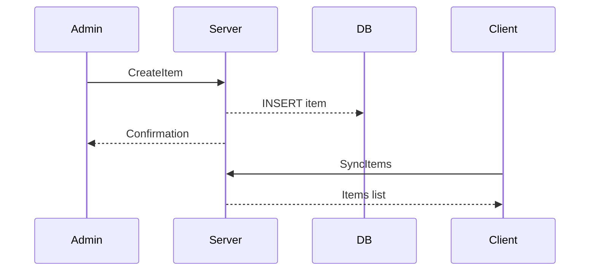

# Guía de desarrollo: Ítems Online

## 1. Introducción
Detalla la definición, gestión y sincronización de ítems en modo multijugador online. Incluye control de versiones, mercado y trading.

## 2. Esquemas y Versionado
- JSON Schema en `schemas/ItemsOnlineSchema.json`:
  - Campos obligatorios: `id`, `name`, `description`, `stackable`, `max_stack`, `attributes`, `version`.
  - Versionado semántico para cambios de campo.

## 3. Mensajes de Definición y Actualización
- **CreateItem**: `{ "item": { ... } }`
- **UpdateItem**: `{ "item_id":"...", "changes":{...}, "version":N }`
- **DeleteItem**: `{ "item_id":"..." }`

> Incluir esquemas en `schemas/ItemsOnlineSchema.json`.

## 4. Módulo Server-Side
- Ruta: `src/roguelike_game/managers/item_manager_online.py`.
- Clases:
  - `ItemManagerOnline` con métodos `create`, `update`, `delete`, `sync_all()`.
  - Control de transacciones y persistencia.

## 5. Cliente: Models y Caching
- `ItemOnlineModel` en `src/roguelike_game/ecs/components/item_online_model.py`.
- Cache local con TTL, estrategias de invalidación.

## 6. UI de Mercado/Trading
- Ventana de catálogo online.
- Formularios de compra/venta.
- Confirmaciones de transacción.

## 7. Seguridad y Permisos
- Validación de roles (admin, jugador).
- Sanitizar entrada de datos.
- Rate-limiting y prevención de abuso.

## 8. Tests y CI
- Unitarios para validadores y esquemas.
- Integración con servidor simulado.
- Pipeline CI valida `ItemsOnlineSchema.json` y corre `pytest`.

## 9. Diagrama de Secuencia Online

