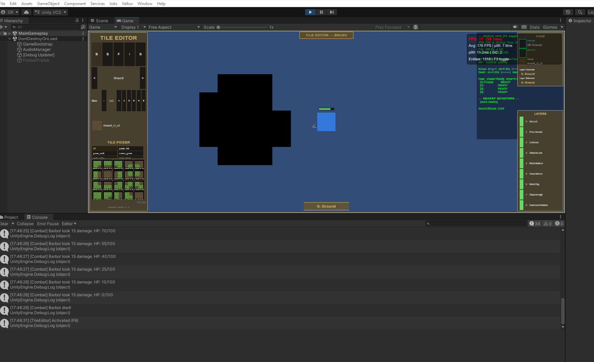

# Tile Editor v1 — Unity Runtime

> **Estado**: UI funcional, **pintado de tiles NO funciona** (renderiza negro).
> **Última actualización**: 2025-02-22

## Screenshot actual



---

## Estado actual

El Tile Editor runtime funciona en Unity con toggle F6. La UI replica los paneles del editor Python original:
- **Panel izquierdo**: toolbar (B/E/F/I/S), selector de layer (< >), brush size (1-5), preview del tile seleccionado, category tabs (grid 2 columnas), tile picker grid scrollable, status bar
- **Panel derecho**: View panel (hovered/selected/choice tile info), Layers panel (9 layers con nombres)
- **Indicador de layer** activo en la parte inferior central ("0: Ground")
- **Border overlay** dorado + label "TILE EDITOR — BRUSH" en la parte superior
- **Grid cursor** (LineRenderer dorado) que sigue al mouse y muestra el tamaño del brush

**Lo que funciona**: toda la UI, selección de tiles, categorías, cambio de layers, brush size, undo/redo, eyedropper, eraser (borra tiles existentes), grid cursor.

**Lo que NO funciona**: al pintar tiles con el brush, estos aparecen como **rectángulos negros sólidos** en el tilemap.

---

## Funcionalidades implementadas

| Feature | Estado | Notas |
|---------|--------|-------|
| Toggle F6 | ✅ | Abre/cierra el editor |
| Toolbar (B/E/F/I/S) | ✅ | Brush, Eraser, Fill, Eyedropper, Select |
| Layer selector (< >) | ✅ | 9 layers, resetea a Ground al abrir |
| Brush size (1-5) | ✅ | Botones -/+ y números directos |
| Tile Picker | ✅ | Grid scrollable, carga runtime desde Resources/Tiles/ |
| Category tabs | ✅ | Grid 2 columnas, "All" por defecto, 8 categorías |
| Selected tile preview | ✅ | Sprite + nombre del tile seleccionado |
| View panel | ✅ | Hovered/Selected/Choice tile info + layer info |
| Layers panel | ✅ | 9 layers con nombres |
| Grid cursor | ✅ | LineRenderer dorado, cambia color por tool |
| Border overlay | ✅ | Borde dorado + label herramienta activa |
| Undo/Redo | ✅ | Ctrl+Z / Ctrl+Shift+Z (max 50 operaciones) |
| Brush painting | ❌ | **BUG ABIERTO: tiles se pintan en negro** |
| Fill tool | ❌ | Mismo bug de renderizado negro |
| Eraser | ✅ | Funciona correctamente |
| Eyedropper | ✅ | Funciona correctamente |
| Collision panel | ❌ | Pendiente (futuro) |
| Save/Load JSON | ❌ | Pendiente (futuro) |
| Tutorial panel | ❌ | Pendiente (futuro) |

---

## 🔴 ISSUE ABIERTA: Tiles se pintan en negro

### Síntoma
Al pintar tiles con el brush, estos aparecen como rectángulos negros sólidos en el tilemap, en lugar de mostrar la textura del sprite. El tile picker UI muestra los sprites correctamente. El `SetTile()` se ejecuta sin errores. Los tiles se colocan en la posición correcta pero su textura no se renderiza.

### Datos del diagnóstico (debug log)
```
tile=tileset3_r1_c1 type=Tile sprite=tileset3_r1_c1 ppu=32 color=RGBA(1,1,1,1)
tilemap=Ground sortLayer=Ground sortOrder=0 rendererEnabled=True
mat=Default (Instance) shader=Universal Render Pipeline/2D/Sprite-Lit-Default
tilemapColor=RGBA(1,1,1,1)
```

### Causa raíz identificada
**El proyecto usa URP (Universal Render Pipeline).** Verificado en `ProjectSettings/GraphicsSettings.asset`:
```yaml
m_CustomRenderPipeline: {fileID: 11400000, guid: 681886c5eb7344803b6206f758bf0b1c, type: 2}
m_SRPDefaultSettings:
  UnityEngine.Rendering.Universal.UniversalRenderPipeline: {fileID: 11400000, guid: 93b439a37f63240aca3dd4e01d978a9f, type: 2}
```

Con URP, Unity asigna automáticamente el material **`Sprite-Lit-Default`** a los `TilemapRenderer`. Este material requiere **luces 2D** (`Light2D`) para renderizar sprites. Sin ninguna `Light2D` en la escena, todos los tilemaps se renderizan como **negro sólido**.

El UI Canvas no se ve afectado porque usa su propio pipeline de renderizado (`CanvasRenderer`), por eso el tile picker muestra los sprites correctamente.

### Cronología de intentos de solución

| # | Intento | Resultado |
|---|---------|-----------|
| 1 | Deshabilitar brush preview `SpriteRenderer` | No resolvió — el negro viene del tilemap, no del preview |
| 2 | Registrar `SpriteAtlasManager.atlasRequested` callback | No funcionó — el atlas no está en Resources |
| 3 | Eliminar `Atlas_Tiles.spriteatlas` completamente | No resolvió — el negro persiste sin atlas |
| 4 | Mover sprites a `Resources/Tiles/` y crear tiles en runtime | Tile picker funciona, pero el negro persiste |
| 5 | Crear `TileCatalog.BuildFromResources()` (tiles runtime sin .asset) | Tile picker funciona, negro persiste |
| 6 | Añadir `Global Light 2D` via `using UnityEngine.Rendering.Universal` | Error de compilación: assembly reference faltante |
| 7 | Crear `Light2D` via reflexión (`System.Type.GetType`) | Compila, pero `Light2D` type puede no encontrarse en runtime si el paquete URP 2D Renderer no está instalado correctamente |

### Solución pendiente (próximo intento)

La solución correcta requiere **una de estas opciones** (en orden de preferencia):

#### Opción A: Añadir Light2D desde la escena (manual, sin código)
1. En Unity Editor, abrir la escena de gameplay
2. **GameObject → Light → 2D → Global Light 2D**
3. Configurar: intensity=1, color=white
4. Guardar la escena
5. Play + F6 → los tiles deberían renderizarse correctamente

#### Opción B: Cambiar material de TilemapRenderer a Unlit
En `WorldGridBuilder.CreateTilemapLayer()`, después de crear el `TilemapRenderer`:
```csharp
// Buscar el material Sprite-Unlit-Default que no requiere luces
var unlitShader = Shader.Find("Universal Render Pipeline/2D/Sprite-Unlit-Default");
if (unlitShader != null)
    renderer.sharedMaterial = new Material(unlitShader);
```

#### Opción C: Añadir assembly reference a URP
1. Crear un `.asmdef` para los scripts de gameplay
2. Añadir referencia a `Unity.RenderPipelines.Universal.Runtime`
3. Usar `Light2D` directamente sin reflexión

#### Opción D: Verificar paquete URP 2D Renderer
1. Window → Package Manager
2. Verificar que **Universal RP** incluye el **2D Renderer**
3. Si no, instalar/actualizar el paquete
4. La reflexión en `EnsureGlobalLight2D()` debería funcionar

---

## Arquitectura

### Archivos principales
```
Scripts/Gameplay/TileEditor/
├── TileEditorManager.cs       — Orquestador principal, input, undo/redo, toggle F6
├── TileEditorState.cs         — Estado mutable (tool, layer, tile, brush size)
├── TileEditorUI.cs            — UI programática completa (Canvas, paneles, botones)
├── TileEditorBorderOverlay.cs — Borde dorado de pantalla + label herramienta
├── TileEditorGridCursor.cs    — Cursor de grid (LineRenderer + fill quad)
├── TileBrush.cs               — Operaciones: Paint, Erase, FloodFill, Pick
├── TileCatalog.cs             — ScriptableObject + BuildFromResources() runtime
└── TileRegistry.cs            — Singleton de lookup de tiles por nombre

Scripts/Editor/
└── TilePaletteBuilder.cs      — Genera tile assets, palette, y catálogo (editor-only)

Scripts/Gameplay/Rendering/
├── WorldGridBuilder.cs        — Crea Grid + 9 Tilemaps en runtime
└── TilemapLayerSetup.cs       — Configura sorting layers por tilemap

Scripts/Gameplay/
└── GameplaySceneSetup.cs      — Bootstrap: crea grid, light2D, VFX, tile editor, player
```

### Flujo de datos (actual — runtime)
1. `GameplaySceneSetup.Start()` → crea `WorldGridBuilder` (Grid + 9 Tilemaps)
2. `GameplaySceneSetup` → intenta crear `Global Light 2D` via reflexión
3. `GameplaySceneSetup` → crea `TileEditorManager`
4. `TileEditorManager.Start()` → `TileCatalog.BuildFromResources()` (carga sprites de `Resources/Tiles/{category}/`, crea `Tile` instances en runtime)
5. `TileEditorUI.Initialize()` → construye toda la UI programáticamente
6. Usuario presiona F6 → editor se activa
7. Usuario selecciona tile del picker → `_state.SelectedTile = entry.tile`
8. Usuario pinta → `TileBrush.Paint(tilemap, cellPos, tile, brushSize)`
9. `tilemap.SetTile(pos, tile)` → **TilemapRenderer renderiza NEGRO** (falta Light2D)

### Sprites
- **Ubicación**: `Assets/_Project/Resources/Tiles/{category}/` (movidos desde `Art/Tiles/ready/`)
- **Formato**: PNG, 32x32 pixels, PPU=32 (1 tile = 1 world unit)
- **Categorías**: grass_dirt, grass_rock, ocean_grass, rock_water, sand_grass, sand_ocean, sand_ocean_2, sand_rock
- **Total**: ~312 sprites (incluye subcarpetas `_slices/`)
- **SpriteAtlas**: ELIMINADO (`Atlas_Tiles.spriteatlas` fue borrado)

### Layers (TilemapLayerSetup.TilemapLayer)
| Index | Nombre | Sorting Layer | Notas |
|-------|--------|---------------|-------|
| 0 | Ground | Ground | Layer por defecto del editor |
| 1 | FloorDecals | FloorDecals | |
| 2 | Collision | (renderer disabled) | Solo colisión |
| 3 | ObjectsLow | ObjectsLow | |
| 4 | WallsBottom | WallsBottom | + TilemapCollider2D |
| 5 | Decorations | Decorations | |
| 6 | WallsTop | WallsTop | |
| 7 | ObjectsHigh | ObjectsHigh | |
| 8 | OverheadDetails | Overhead | |

### Sorting Layers (TagManager.asset)
```
Default, Ground, GroundDecoration, Buildings, Entities, Projectiles, VFX, UI_World, Overlay
```
**Nota**: Hay mismatch entre `SortingConfig.cs` y `TagManager.asset`:
- `FloorDecals` en código → `GroundDecoration` en TagManager
- `ObjectsLow`, `WallsBottom`, `Decorations`, `WallsTop`, `ObjectsHigh` → NO existen en TagManager
- Solo `Ground`, `Entities`, `Overlay` coinciden

---

## Cambios realizados en esta sesión

### Commits relevantes
1. **fix(tile-editor): Disable brush preview SpriteRenderer** — eliminó el preview que se superponía
2. **fix(tile-editor): Delete SpriteAtlas** — eliminó `Atlas_Tiles.spriteatlas` y tile assets
3. **feat(tile-editor): Runtime tile catalog from Resources/Tiles/** — movió sprites a Resources, creó `BuildFromResources()`
4. **fix(tile-editor): Add Global Light 2D** — intento de crear Light2D para URP
5. **fix: Use reflection for Light2D** — evita dependency en assembly URP

### Archivos modificados
- `TileCatalog.cs` — añadido `BuildFromResources()` estático
- `TileEditorManager.cs` — usa `BuildFromResources()`, eliminó debug logging, deshabilitó brush preview
- `WorldGridBuilder.cs` — añadido `detectChunkCullingBounds`
- `GameplaySceneSetup.cs` — añadido `EnsureGlobalLight2D()` via reflexión
- `TilePaletteBuilder.cs` — actualizado path a `Resources/Tiles`
- Sprites movidos: `Art/Tiles/ready/` → `Resources/Tiles/`
- Eliminados: `Atlas_Tiles.spriteatlas`, todos los `.asset` en `TileAssets/`, `TileCatalog.asset`

---

## Pendientes futuros

| Prioridad | Feature | Descripción |
|-----------|---------|-------------|
| **ALTA** | Fix black tiles | Resolver el renderizado negro (ver opciones arriba) |
| Media | Collision panel | Panel para pintar tiles de colisión |
| Media | Save/Load JSON | Guardar/cargar mapas editados |
| Media | Sorting layer mismatch | Alinear `SortingConfig.cs` con `TagManager.asset` |
| Baja | Tutorial panel | Panel de ayuda con shortcuts |
| Baja | Brush preview | Re-habilitar preview con material correcto |
